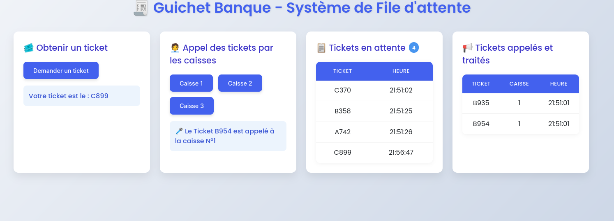

# 🧾 Système de File d’Attente – Guichet de Banque

Ce projet est une application Java simple (sans framework) qui simule un système de ticket comme dans une banque avec plusieurs caisses. Il permet de :

- Générer un ticket aléatoire (ex : A025)
- Appeler le prochain ticket à une caisse (Caisse 1, 2, 3…)
- Afficher les tickets en attente
- Afficher les tickets déjà appelés
- Utiliser une interface web claire et intuitive
- Être exécuté dans un conteneur Docker

---

## 📁 Arborescence
    ├── assets/
    | └── screenshot3.png
    ├── lib/
    │ └── gson-2.8.9.jar
    ├── public/ 
    │ └── index.html
    ├── src/ 
    │ ├── Main.java
    │ ├── Ticket.java
    │ ├── TicketService.java
    │ ├── APIHandler.java
    │ ├── StaticHandler.java
    ├── .dockerignore 
    ├── .gitignore
    ├── build.sh
    └── Dockerfile
    └── README.md

---

## 🚀 Lancer l'application

### 🔧 Prérequis

- Java 17+
- Docker (si vous souhaitez le lancer dans un conteneur)
- `gson-2.8.9.jar` placé dans le dossier `lib/`  
  ➡️ [Télécharger ici](https://repo1.maven.org/maven2/com/google/code/gson/gson/2.8.9/gson-2.8.9.jar)

---

### ⚙️ Option 1 – Lancer en local

#### 1. Compiler et lancer

        javac -cp "lib/gson-2.8.9.jar" src/*.java

        java -cp "lib/gson-2.8.9.jar:src" Main

### ou simplement avec la commande bash qui lancera le projet automatiquement 
        bash build.sh        

##  🐳 Option 2 – Lancer avec Docker

### 1. Construire l’image Docker

        docker build -t bank-queue-app .

### 2. lancer l’image Docker avec le port 8080       
        
        docker run -p 8080:8080 bank-queue-app

🌐 API REST (JSON)
| Endpoint       | Méthode | Description                           |
| -------------- | ------- | ------------------------------------- |
| `/ticket`      | POST    | Génère un ticket                      |
| `/caisse/{id}` | POST    | La caisse appelle le prochain ticket  |
| `/etat`        | GET     | Donne la file d’attente et les appels |

🖼️ Interface Web
L’interface utilisateur est dynamique et intuitive :
    Un bouton pour demander un ticket
    Trois boutons pour appeler depuis les caisses
    Deux tableaux :
        Tickets en attente
        Tickets appelés et traités

    Aperçu de la responsivité de l'interface 

🧠 Objectifs pédagogiques

    Apprentissage de l’architecture REST

    Gestion de file FIFO

    Communication front/back simple (fetch API)

    Utilisation de Gson (sans framework)

    Déploiement en conteneur Docker

👤 Auteur
Projet réalisé par Rynah – Étudiant DevOps & Infrastructure